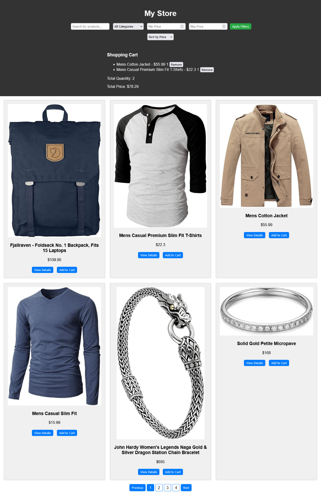

# My Store

Welcome to My Store, a simple e-commerce website made to showcase real store data.

 

### Homepage of the website  contains the following sections:

- Search Filter: allows users to search for products by keyword and filter products by category or by price range.

- Shopping Cart: displaying the items in the user's shopping cart, along with the total quantity and total price.

- Product List: displaying a list of products, with each product having an image, title, price, and buttons to view details and add to cart.

- Pagination: allowing users to navigate through pages of products.

### The functionality of the website is implemented in the scripts.js file. 

- Fetch Products: fetches the list of products from the API .

- Display Pagination:displays the pagination buttons based on the current page and the total number of products.

- Display Products:displays the list of products on the current page.

- Apply Filter: applying the search filter and category filter to the list of products.

- Add to Cart: This function adds a product to the user's shopping cart.

- Remove from Cart:removes a product from the user's shopping cart.

- Update Cart: updates the shopping cart section of the page with the items in the cart.

